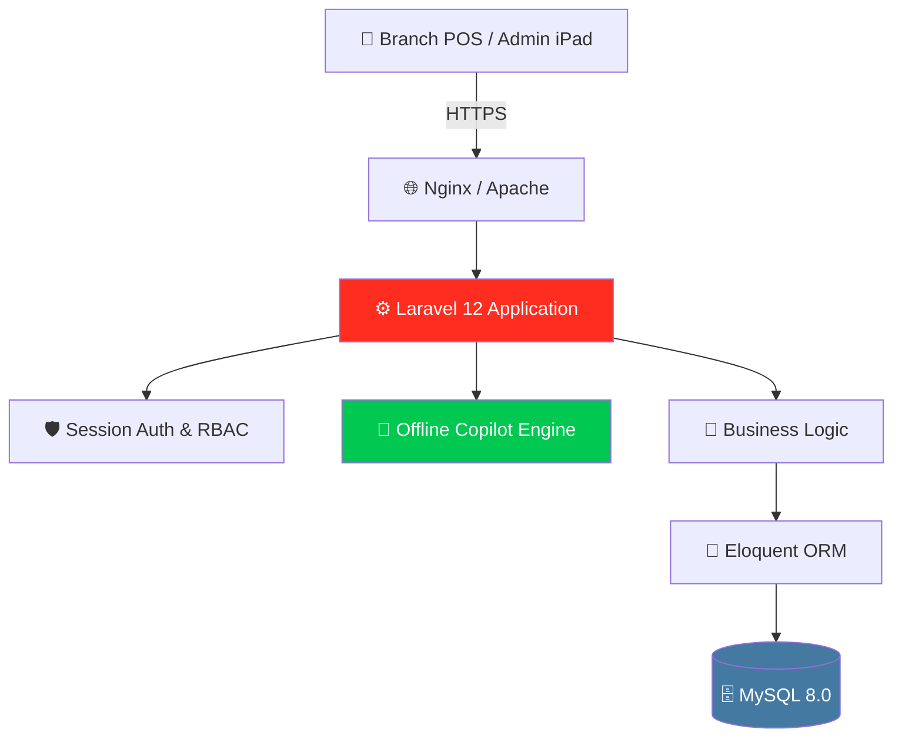
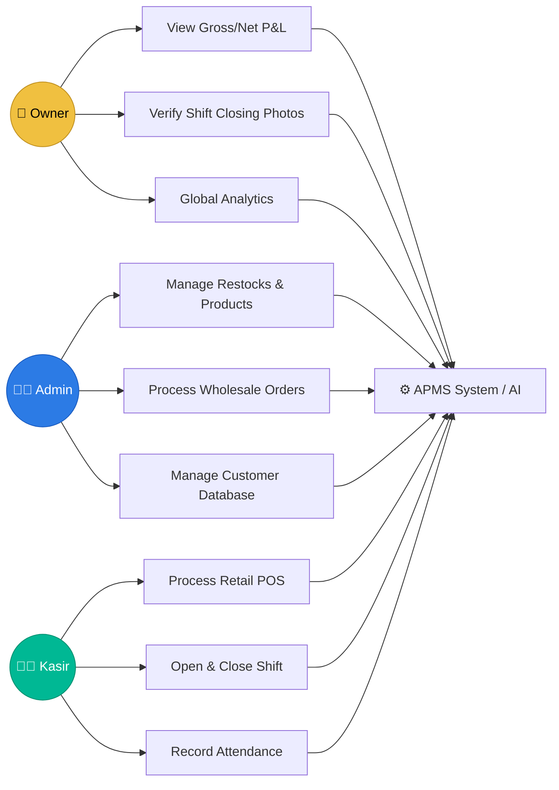
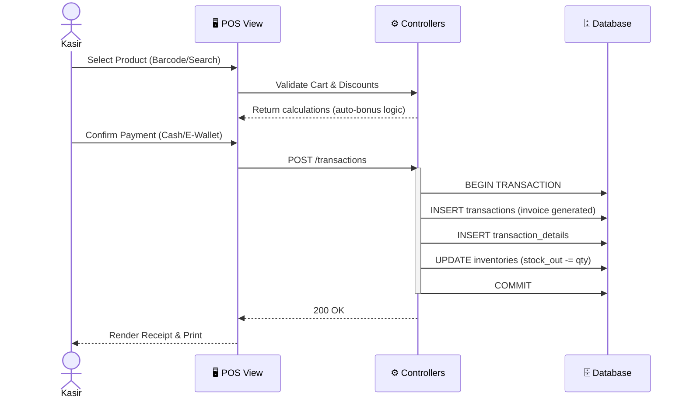
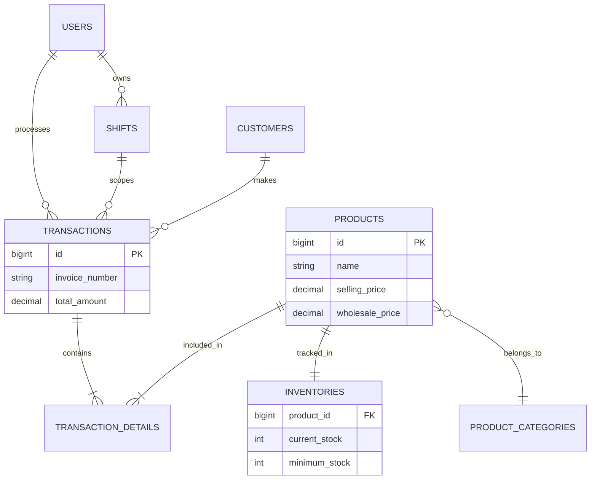
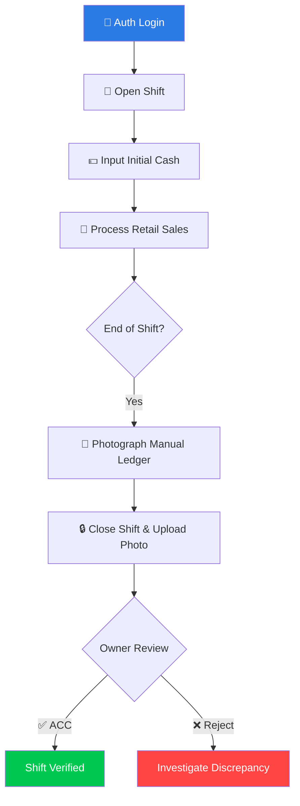

<p align="center">
  
  
  <br>
  
  
  
</p>

<h1 align="center">
  💎 APMS — Ashar Parfum Management System
</h1>

<p align="center">
  <strong>The Ultimate Enterprise Point-of-Sale & Business Intelligence Platform</strong><br>
  <sub>Powering Ashar Grosir Parfum Bekasi · Made in Indonesia · Built for Scale</sub>
</p>

<p align="center">
  <a href="#-overview">Overview</a> •
  <a href="#-core-modules">Core Modules</a> •
  <a href="#-apms-copilot-ai">APMS Copilot (AI)</a> •
  <a href="#-system-architecture">Architecture</a> •
  <a href="#-security">Security</a> •
  <a href="#-quick-start">Quick Start</a>
</p>

---

## 📌 Overview

**APMS** (Ashar Parfum Management System) is the proprietary enterprise management platform of **Ashar Grosir Parfum Bekasi** — Indonesia's premier fragrance wholesale and retail distributor.

APMS is not a generic POS system. It is a purpose-built, high-performance ecosystem designed to solve the specific operational complexities of a large-scale perfume business. The system unifies retail point-of-sale, wholesale distribution, AI-driven business intelligence, automated inventory deductions, employee accountability loops, and full financial reporting into a single command center.

> _"We don't just sell perfume. We orchestrate fragrance commerce at scale."_

---

## ✨ Core Modules

### 🏪 Point-of-Sale (POS) Engine

- **Dual-Mode Commerce:** Unified interface for Retail (Eceran) and Wholesale (Grosir).
- **Automated Promotional Logic:** Auto-allocates bonus products based on purchase volume (e.g., free 20ml standard for every 100ml premium).
- **Loyalty & Discount Engine:** Supports dynamically generated coupons, percentage discounts, and fixed cuts.
- **Financial Flexibility:** Supports PPN (10-11%) toggles, multi-payment methods (Cash, GoPay, OVO, Dana, Transfer), and Debt/Kas Bon management.

### 📦 Supply Chain & Inventory

- **Real-Time Deductions:** Warehouse inventory automatically syncs and deducts upon retail sale or wholesale order confirmation.
- **Stock Audit & Discrepancy Tracking:** Complete opname/audit module with physical vs. system variance detection.
- **Low-Stock Intelligence:** Dynamic product statuses (`in_stock`, `low_stock`, `out_of_stock`) with visual dashboard alerts when crossing minimum stock thresholds.
- **Wholesale Order Lifecycle:** Track wholesale orders from `Pending` → `On Progress` → `Ready to Ship` → `Completed`.

### 👥 Employee & Accountability Loop

- **Strict Shift Management:** Financial integrity ensured via mandatory Open/Close Shift protocols.
- **Digital Cash Reconciliation:** Cashiers must upload photographic evidence of manual ledgers at end-of-shift. Owners perform digital review/ACC.
- **Role-Based Access (RBAC):** Military-grade isolation between Owner, Admin, and Kasir roles across all endpoints.
- **Attendance Logging:** One-click Check-in/Check-out for automated timesheets.

### 📊 Business Intelligence & Reporting

- **P&L Generation:** Real-time Gross vs. Net Profit calculus, auto-deducting logged operating expenses.
- **Data Visualization:** Interactive Chart.js dashboards showing monthly trajectories, sales composition, and top-performing products.
- **Granular Export:** Bank-grade PDF & CSV exportation for daily, weekly, and monthly ledgers.

---

## 🤖 APMS Copilot (Artificial Intelligence)

The crown jewel of APMS is the **Offline APMS Copilot** — a locally-hosted, rule-based Expert System deeply integrated into the database, guaranteeing 100% data privacy with zero third-party API dependencies.

 

**Capabilities:**

- **Live Financial Querying:** _"Berapa transaksi bulan ini?"_ (Fetches real-time revenue and count).
- **Instant Stock Scans:** _"Mana produk yang kritis?"_ or _"Cek stok baccarat"_.
- **Deep Routing Navigation:** Understands 17+ core intents and directly renders clickable HTML action buttons linking to the exact administrative page needed.
- **Integrated Knowledge Base:** Contains a 30-topic neural manual covering system troubleshooting, printer setups, how-to guides, and operational SOPs.
- **Floating UI Widgets:** High-density, visually stunning Quick Action Chips and animated chat logic.

---

## 🏗️ System Architecture

APMS is built on a modern, decoupled monolithic PHP infrastructure designed for 99.9% uptime and extreme data longevity.



### Database Integrity Strategy

- **`BIGINT` Primary Keys:** Supports 9.2 quintillion records, zero re-keying needed.
- **Soft Deletes:** Immutable historical states; no record is ever permanently destroyed.
- **`DECIMAL(15,2)` Financials:** Absolutely zero floating-point computation errors for RP currency.
- **ACID Compliant Transactions:** `DB::beginTransaction()` wrappers on all critical POS and Wholesale actions to prevent race conditions.

---

## � System Diagrams

### 1. Use Case Diagram

> Depicts the primary actors and their core interactions with the platform.



### 2. Sequence Diagram (Retail POS Checkout)

> The data lifecycle when a Cashier performs a standard retail transaction.



### 3. Class Diagram / ERD (Core Entities)

> Core data models powering the APMS application.



### 4. Operational Workflow (Accountability Loop)

> The mandatory daily shift lifecycle ensuring strict financial integrity over the long term.



---

## �🚀 Quick Start

### Prerequisites

- **PHP** ≥ 8.2 (Extensions: pdo_mysql, gd, zip)
- **Composer** 2.x
- **MySQL** ≥ 8.0

### Local Installation

```bash
# 1. Clone Repo
git clone https://github.com/ashar-parfum/APMS.git
cd APMS

# 2. Install Packages
composer install --optimize-autoloader

# 3. Environment Setup
cp .env.example .env
php artisan key:generate

# 4. Configure Database in .env
# DB_DATABASE=apms_db

# 5. Migrate & Seed
php artisan migrate --seed --seeder=ComprehensiveSeeder

# 6. Storage Link & Run
php artisan storage:link
php artisan serve
```

### Default Credentials (Post-Seeding)

| Role      | Email           | Password |
| --------- | --------------- | -------- |
| **Owner** | owner@ashar.com | password |
| **Admin** | admin@ashar.com | password |
| **Kasir** | kasir@ashar.com | password |

---

## 🛡️ Security Posture

- **CSRF Mitigation:** Enforced token validation across all mutable verbs.
- **XSS Prevention:** Auto-escaped rendering via Laravel Blade engine.
- **SQLi Protection:** Strict parameterized binding via PDO.
- **Data Encapsulation:** Critical settings (like Backup & Restore actions) are restricted explicitly to the `owner` tier.
- **Mass Assignment:** Hardened Models using guarded/fillable attributes.

---

## 📞 Support & Engineering

APMS is developed in-house to secure the technological future of the Ashar Grosir Parfum Group.

**Ashar Grosir Parfum Bekasi**  
📍 Bekasi, West Java, Indonesia 🇮🇩  
🌐 [ashargrosirparfum.com](http://www.ashargrosirparfum.com)

**Technical Architect:**  
Wisnu Alfian Nur Ashar  
✉️ eng@asharparfum.com

---

<p align="center">
  <sub>Copyright © 2024–2026 Ashar Grosir Parfum Group. All Rights Reserved.</sub><br>
  <sub>APMS is proprietary software. Unauthorized reproduction, modification, or distribution is strictly prohibited.</sub>
</p>
