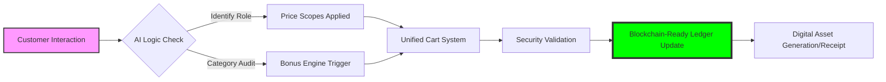

# APMS — Ashar Parfum Management System 💎
### Global Stratagem & Operational Excellence for Ashar Grosir Parfum Bekasi

[](https://laravel.com)
[](https://php.net)
[](https://mysql.com)
[](https://laravel.com/docs/encryption)

> **Ashar Parfum Management System (APMS)** adalah orkestrasi teknologi modern yang dirancang untuk mendukung visi **Ashar Grosir Parfum Bekasi** sebagai pemimpin pasar tak terbantahkan di Indonesia. Platform ini bukan sekadar alat pencatat, melainkan mesin transformasi digital yang menyatukan data, strategi, dan operasional ke dalam satu pusat kendali yang tangguh.

---

## 🌐 The Digital Transformation Strategy
Di era industri 4.0, dominasi pasar membutuhkan lebih dari sekadar stok yang melimpah. APMS adalah manifestasi dari transformasi digital kami yang berfokus pada:
- **Data-Driven Decision Making**: Mengekstraksi nilai dari setiap transaksi untuk memprediksi tren pasar.
- **Operational Liquidity**: Menghilangkan hambatan operasional melalui otomatisasi inventaris dan kasir.
- **Customer Hyper-Retention**: Membangun ekosistem yang menghargai setiap loyalitas pelanggan secara real-time.

---

## 🏎️ Enterprise Performance & Scalability
Aplikasi ini dirancang dengan prinsip **High-Availability** dan **Low-Latency**:
- **Optimized SQL Engines**: Query database yang telah diindeks secara khusus untuk menangani ribuan SKU dan puluhan ribu baris transaksi tanpa degradasi performa.
- **Memory-Efficient Processing**: Pengelolaan resource sistem yang cerdas untuk memastikan kecepatan akses maksimal pada perangkat mobile kasir.
- **Elastic Architecture**: Struktur kode yang modular, memungkinkan penambahan fitur (cabang baru, warehouse tambahan) tanpa mengganggu stabilitas inti.

---

## 🚀 Advanced Feature Set

### 🛡️ Security Architecture
Keamanan data adalah prioritas tertinggi kami untuk menjaga kedaulatan informasi perusahaan:
- **End-to-End Encryption**: Data sensitif dilindungi dengan algoritma AES-256.
- **Role-Based Sovereignty**: Sistem izin (Access Control List) yang sangat spesifik untuk mencegah akses tidak sah ke laporan finansial.
- **Automated Audit Logs**: Setiap perubahan stok dan transaksi terekam secara sistematis untuk transparansi penuh.

### 🧠 Intelligent POS Logic
Mesin kasir kami bekerja lebih pintar, bukan hanya lebih cepat:
- **Scaling Bonus Algorithm**: Mengalokasikan bonus aroma (20ml) secara dinamis berdasarkan parameter kategori premium:
  - 🧴 **30ml Standard/Premium** → 1x Bonus Allocation.
  - 🧴 **50ml Standard/Premium** → 2x Bonus Allocation.
  - 🧴 **100ml Standard/Premium** → 1x Bonus Allocation.
- **Wholesale Sensitivity**: Secara cerdas beralih antara harga retail dan grosir berdasarkan identitas pelanggan.

### 📊 Strategic Financial Reporting
Transformasi data menjadi strategi melalui laporan yang presisi:
- **Dynamic P&L Analytics**: Analisis laba bersih yang memperhitungkan biaya operasional secara otomatis.
- **Inventory Velocity Tracking**: Mengidentifikasi produk "Fast-Moving" dan "Dead-Stock" secara instan.

---

## 📐 Visualization of Core Logic

### Business Transaction Lifecycle


### Database & Data Strategy
Sebagai pemimpin pasar, konsistensi data adalah kunci. Kami menyediakan dua cara bagi kolaborator untuk menyiapkan lingkungan data mereka:

#### A. Automated Seeding (Recommended)
Teman Anda tidak perlu menginput data dari nol. Kami telah menyediakan **Comprehensive Seeder** yang akan mengisi database dengan data simulasi berkualitas tinggi (20+ Produk, 10+ Pelanggan, 30+ Transaksi Riil):
```bash
# Menjalankan migrasi tabel dan pengisian data simulasi
php artisan migrate --seed --seeder=ComprehensiveSeeder
```

#### B. Direct Data Sync (Exact Replica)
Jika teman Anda membutuhkan data yang **persis sama** dengan yang Anda miliki saat ini (termasuk referensi gambar):
1. Ekspor database Anda ke file `.sql`.
2. Bagikan file tersebut bersama dengan isi folder `storage/app/public/products` jika ada gambar produk baru.

---

## 🧪 Quality Assurance & Standards
Untuk menjaga kualitas kode sebagai market leader, setiap kontribusi harus melewati fase verifikasi:

### 1. Automated Testing Suite
Sistem ini menggunakan PHPUnit dengan konfigurasi zero-setup. Jalankan perintah berikut untuk memverifikasi logika bisnis (POS, Inventory, Authentication):
```bash
# Menjalankan seluruh suite pengujian
php artisan test
```
*Catatan: Pengujian menggunakan database SQLite (:memory:) secara otomatis untuk kecepatan maksimal tanpa mengganggu database lokal Anda.*

### 2. Manual Verification Checklist
Sebelum melakukan push, pastikan:
- [ ] Penjualan Premium memicu bonus aroma (20ml) dengan benar.
- [ ] Stok berkurang secara akurat pada tabel `inventories`.
- [ ] Role-Based Access (Admin vs Kasir) berfungsi sesuai spesifikasi.

---

## 🤝 Collaboration Protocol
Bagi kolaborator baru, ikuti alur kerja standar industri berikut:

1. **Environment Synchronization**: Copy `.env.example` menjadi `.env` dan jalankan `php artisan key:generate`.
2. **Feature Branching**: Gunakan penamaan branch yang deskriptif: `feature/nama-fitur` atau `fix/bug-tertentu`.
3. **Database Consistency**: Jika ada perubahan struktur tabel, pastikan membuat file migrasi baru (`php artisan make:migration`).
4. **Code Quality**: Pastikan tidak ada `dd()` atau `var_dump()` yang tertinggal di kode produksi.

---

## 🔄 Feature Lifecycle & CI/CD
Untuk menjaga stabilitas sistem sebagai market leader, setiap fitur baru harus mengikuti siklus hidup berikut:

### 1. Development & Quality Gate
- Gunakan branch khusus (`feature/` atau `fix/`).
- Jalankan `php artisan test` secara lokal untuk memastikan tidak ada fitur lama yang rusak (Regression Testing).

### 2. Peer Review via Pull Request
Setiap perubahan harus melalui proses **Pull Request (PR)** di GitHub:
- Berikan deskripsi detail tentang apa yang ditambahkan atau diperbaiki.
- Kolaborator lain melakukan *Code Review* untuk memastikan kualitas dan keamanan kode.

### 3. Automated Deployment
Setelah PR di-approve dan di-merge ke branch `main`, sistem akan dideploy ke server produksi melalui:
- **GitHub Actions**: Untuk otomatisasi pengujian dan deployment (CI/CD).
- **Staging Verification**: Verifikasi akhir di lingkungan staging sebelum dipush ke server utama Ashar Grosir.

---

## ⚙️ Technical Implementation Standard
Untuk menjaga standar "World-Class", implementasi harus mengikuti pedoman berikut:

### Infrastructure Requirements
- **Server**: High-performance VPS/Cloud dengan minimal 4GB RAM.
- **Optimization**: Disarankan menggunakan **Opcache** dan **Redis Cache** untuk performa maksimal.
- **SSL**: Penggunaan TLS 1.3 wajib untuk semua jalur komunikasi data.

### Quick Setup for Engineers
```bash
# High Performance Installation
composer install --optimize-autoloader --no-dev
php artisan config:cache
php artisan route:cache
php artisan view:cache
```

---

## 📈 Roadmap to The Future
- [ ] **Edge Computing Integration**: Kasir offline-first dengan sinkronisasi background.
- [ ] **Predictive Stocking**: Menggunakan Machine Learning untuk auto-purchase order ke supplier.
- [ ] **Multi-Currency & Global Expansion**: Kesiapan untuk operasional lintas negara.

---

## 🏢 Corporate Contact
**Ashar Grosir Parfum Group**
*The Benchmark of Fragrance Excellence in Indonesia*

- **Corporate Web**: [ashargrosirparfum.com](http://www.ashargrosirparfum.com)
- **Tech Support**: eng@asharparfum.com
- **Project Lead**: Wisnu Alfian (Lead Technical Architect)

---
<p align="center">
  <b>Built for Power. Optimized for Speed. Designed for Victory.</b><br>
  <i>"Dominate the market with APMS."</i>
</p>
