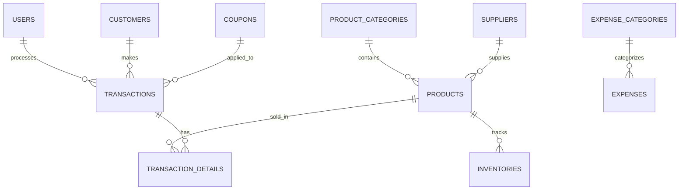
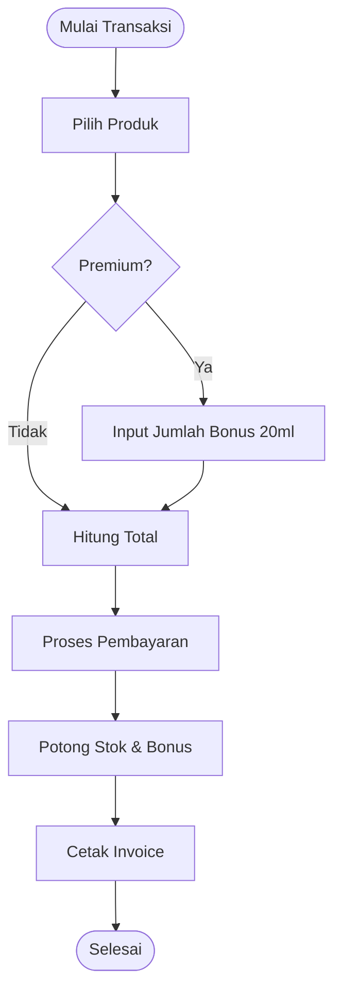

# APMS - Ashar Parfum Management System 💎

[](https://laravel.com)
[](https://php.net)
[](https://mysql.com)
[](https://getbootstrap.com)
[](https://adminlte.io)

> **Ashar Parfum Management System (APMS)** adalah solusi POS dan Inventaris modern yang dirancang khusus untuk operasional toko parfum grosir dan retail. Dibangun dengan fokus pada kecepatan, akurasi stok, dan kemudahan penggunaan di perangkat mobile.

---

## 📍 Table of Contents
1. [Screenshots / Demo](#-screenshots--demo)
2. [Fitur Utama](#-fitur-utama)
3. [Tech Stack](#-tech-stack)
4. [Instalasi & Penggunaan](#-instalasi--penggunaan)
5. [Arsitektur & Diagram](#-arsitektur--diagram)
6. [Kolaborasi](#-kolaborasi)
7. [Informasi Tambahan](#-informasi-tambahan)

---

## 📸 Screenshots / Demo

### Dashboard Admin

*Tampilan dashboard yang informatif dengan statistik realtime.*

### POS / Kasir System

*Sistem kasir dengan fitur bonus otomatis dan pemilihan kategori cepat.*

---

## ✨ Fitur Utama

- **🚀 POS (Point of Sale)**: Transaksi cepat dengan dukungan scan barcode, diskon, dan manajemen kupon.
- **🎁 Bonus Otomatis**: Sistem deteksi produk Premium yang secara otomatis menawarkan bonus 20ml Sedang.
- **📦 Inventory Management**: Pelacakan stok masuk/keluar secara detail dengan riwayat supplier.
- **💰 Financial Reports**: Laporan laba/rugi, pendapatan harian, dan pencatatan pengeluaran (Expenses).
- **📱 Responsive Mobile UI**: Antarmuka yang telah dioptimalkan secara agresif untuk penggunaan di HP Android/iOS.
- **👥 Customer Management**: Pembedaan tipe pelanggan antara Grosir (Wholesale) dan Eceran (Retail).

---

## 🛠️ Tech Stack

- **Backend**: Laravel 12 (Expressive PHP Framework)
- **Frontend**: AdminLTE 3 (Bootstrap 4 based), jQuery, Select2
- **Database**: MySQL / MariaDB
- **Reporting**: Barryvdh DomPDF
- **Icons**: FontAwesome 5 & Shields.io

---

## ⚙️ Instalasi & Penggunaan

### Prerequisites
- PHP >= 8.2
- Composer
- Node.js & NPM
- MySQL Database

### Installation Steps
1. **Clone repository**
   ```bash
   git clone https://github.com/wi5nuu/APMS.git
   cd APMS
   ```

2. **Install dependencies**
   ```bash
   composer install
   npm install
   ```

3. **Environment Setup**
   ```bash
   cp .env.example .env
   php artisan key:generate
   ```
   *Edit `.env` dan sesuaikan `DB_DATABASE`, `DB_USERNAME`, dan `DB_PASSWORD`.*

4. **Migrate & Seed**
   ```bash
   php artisan migrate --seed
   ```

5. **Compile Assets**
   ```bash
   npm run build
   ```

### Running the App
```bash
php artisan serve
```
Aplikasi dapat diakses di `http://127.0.0.1:8000`.

---

## 📐 Arsitektur & Diagram

### Entity Relationship Diagram (ERD)


### Business Flowchart (POS System)


---

## 🤝 Kolaborasi & Kontribusi

Kami menerima kontribusi untuk pengembangan APMS!
1. Fork Project ini.
2. Buat Feature Branch (`git checkout -b feature/AmazingFeature`).
3. Commit perubahan Anda (`git commit -m 'Add some AmazingFeature'`).
4. Push ke Branch (`git push origin feature/AmazingFeature`).
5. Buka Pull Request.

---

## 📋 Informasi Tambahan

- **License**: Distributed under the MIT License. See `LICENSE` for more information.
- **Author**: [Wisnu](https://github.com/wi5nuu)
- **Roadmap**:
  - [ ] Integrasi WhatsApp Gateway untuk invoice.
  - [ ] Fitur Multi-Warehouse.
  - [ ] Mobile App (Flutter/React Native) wrapper.
- **Contact**: wisnu@example.com / [LinkedIn](https://linkedin.com/in/wisnu)

---
<p align="center">Made with ❤️ for Ashar Parfum</p>
