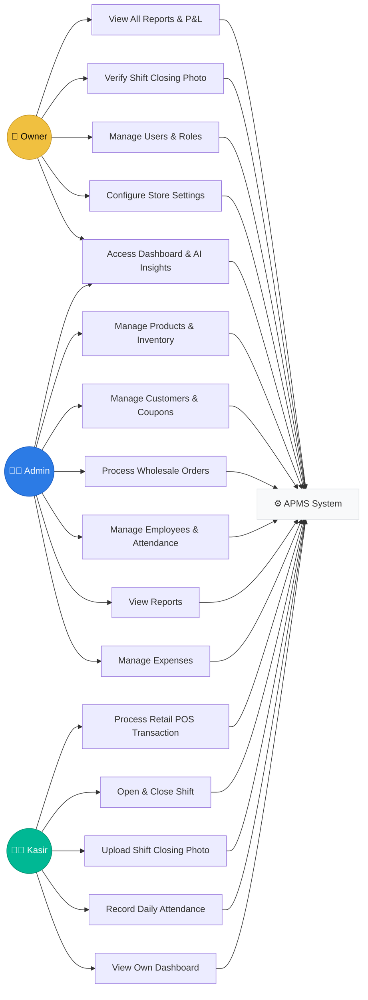
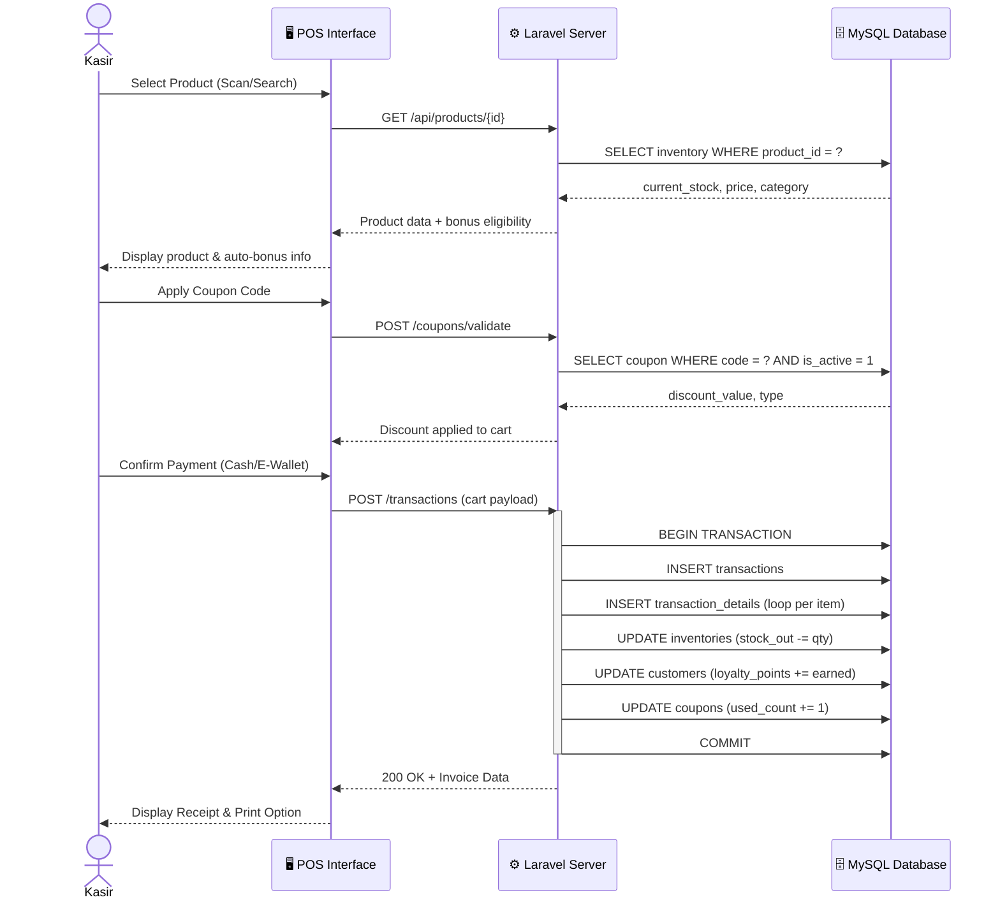
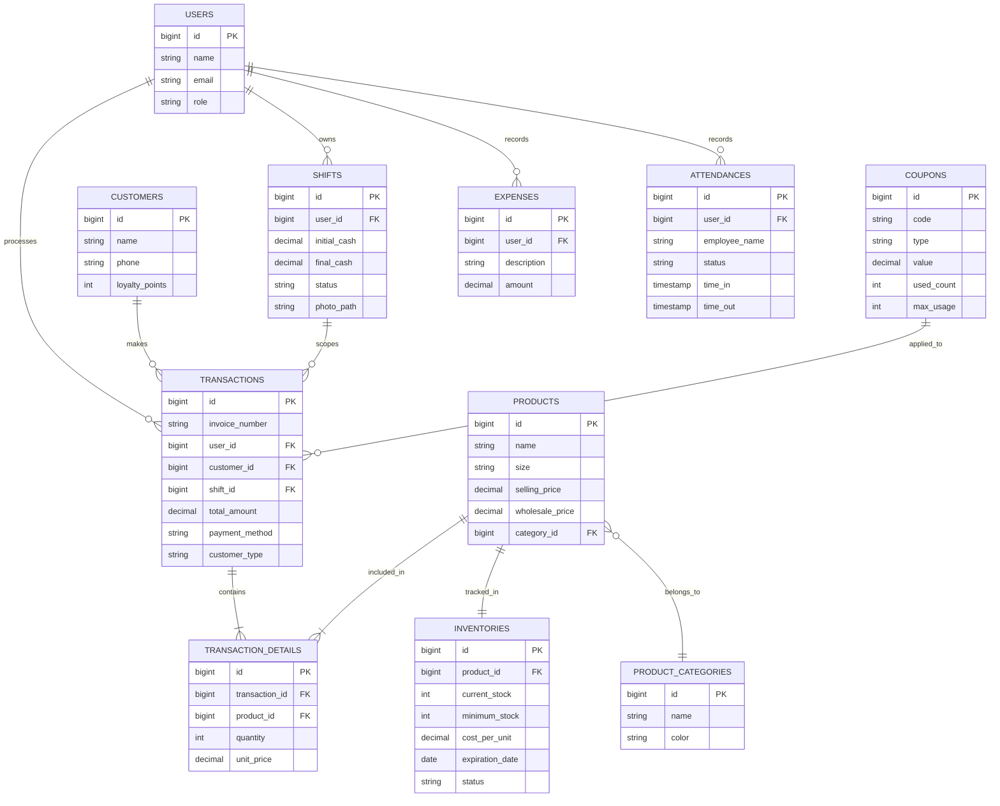
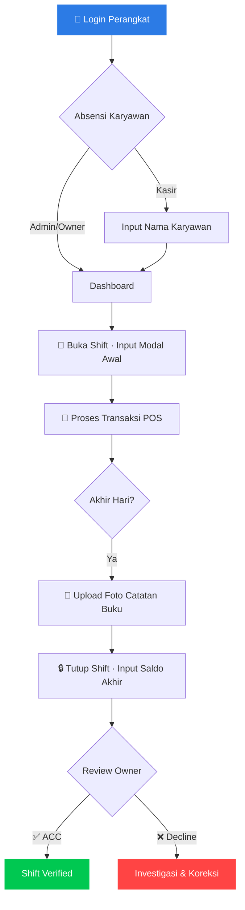

<p align="center">
  
</p>

<h1 align="center">
  💎 APMS — Ashar Parfum Management System
</h1>

<p align="center">
  <strong>Enterprise-Grade Point-of-Sale & Business Intelligence Platform</strong><br>
  <sub>Powering Ashar Grosir Parfum Bekasi · Made in Indonesia · Built for Scale</sub>
</p>

<p align="center">
  <a href="https://laravel.com"></a>
  <a href="https://php.net"></a>
  <a href="https://mysql.com"></a>
  <a href="#"></a>
  <a href="#"></a>
  <a href="#"></a>
</p>

<p align="center">
  <a href="#-overview">Overview</a> ·
  <a href="#-features">Features</a> ·
  <a href="#-system-architecture">Architecture</a> ·
  <a href="#-quick-start">Quick Start</a> ·
  <a href="#-operational-workflow">Workflows</a> ·
  <a href="#-security">Security</a> ·
  <a href="#-roadmap">Roadmap</a> ·
  <a href="#-contact">Contact</a>
</p>

---

## 📌 Overview

**APMS** (Ashar Parfum Management System) is the official, proprietary enterprise management platform of **Ashar Grosir Parfum Bekasi** — Indonesia's premier fragrance wholesale and retail brand. APMS is not a generic ERP. It is purpose-built to solve the specific operational complexities of a high-volume perfume business, from real-time multi-tier pricing to employee accountability and data-driven inventory forecasting.

> **"We don't just sell perfume. We orchestrate fragrance commerce at scale."**
> — *Ashar Grosir Parfum, Bekasi*

This platform unifies **point-of-sale**, **inventory intelligence**, **workforce management**, **financial reporting**, and an **AI-powered insights engine** into a single, cohesive command center — accessible from any device, at any time.

---

## ✨ Features

### 🏪 Point-of-Sale (POS) Engine
| Capability | Detail |
|---|---|
| **Dual-mode Sales** | Seamlessly handles Retail (Eceran) and Wholesale (Grosir) in one unified system |
| **Dynamic Bonus Logic** | Auto-allocates complimentary 20ml fragrances based on purchase tier (30ml/50ml/100ml Premium & Standard) |
| **Coupon & Loyalty Engine** | Issue, redeem, and track percentage/fixed discount coupons with usage limits & expiry |
| **Tax & Payment Flexibility** | Toggle PPN (10%) support, with payment methods: Cash, E-Wallet (GoPay, OVO, Dana), Transfer |
| **Barcode Integration** | Full barcode printing and scanning support for rapid SKU lookup |
| **Real-time Cart** | Instant cart updates, customer selection, and auto-price switching between retail/wholesale |

### 📦 Intelligent Inventory
| Capability | Detail |
|---|---|
| **Multi-batch Tracking** | Track individual product batches with expiry dates and cost-per-unit |
| **Predictive Low-Stock Alerts** | Days-remaining forecast based on average daily sales velocity |
| **Auto-Status Classification** | Items auto-classified as `in_stock` / `low_stock` / `out_of_stock` / `expired` |
| **Stock Audit System** | Full stock audit with discrepancy detection and audit trails |
| **Expiry Management** | Track and flag items expiring within 30 days for proactive discounting |

### 📊 Financial Intelligence
| Capability | Detail |
|---|---|
| **Profit & Loss Reports** | Real-time gross/net P&L with operational expense deduction |
| **Sales Analytics** | Period-based sales (Today, This Week, This Month, This Year) by type |
| **Wholesale Order Tracking** | Track packing days, delivery responsibility, and payment balance vs target |
| **Expense Management** | Track and categorize all business expenses against revenue |
| **PDF Report Export** | Professional-grade PDF exports for all major reports |

### 👥 Workforce & Accountability
| Capability | Detail |
|---|---|
| **Cashier Shift Management** | Full shift open/close cycle with initial cash input and final balance |
| **Digital Verification Loop** | Cashier uploads shift-closing photo of manual ledger; Owner reviews via dashboard |
| **Shared-Device Attendance** | Employees identify themselves per session on shared POS devices |
| **Role-Based Access Control** | Granular ACL: Owner, Admin, Kasir — each with scoped permissions |
| **Employee Master Data** | Manage employee profiles separate from system user accounts |

### 🤖 AI-Powered Business Insights
| Capability | Detail |
|---|---|
| **Smart Insights Engine** | Auto-generates actionable business intelligence on the dashboard daily |
| **Floating AI Assistant** | In-app conversational assistant for sales tips, product inquiries, and strategy |
| **Best-Seller Detection** | Real-time ranking of top-performing products by sales volume |
| **Low-Stock Predictions** | AI-enhanced stock depletion forecasts |

---

## 🏗️ System Architecture

```
┌─────────────────────────────────────────────────────────────────┐
│                        CLIENT LAYER                             │
│   Browser (Desktop / Mobile)  ·  Progressive Web Access        │
└───────────────────────────┬─────────────────────────────────────┘
                            │ HTTPS / TLS 1.3
┌───────────────────────────▼─────────────────────────────────────┐
│                   APPLICATION LAYER (Laravel 12)                │
│  ┌────────────┐  ┌───────────────┐  ┌────────────────────────┐ │
│  │  Auth &    │  │  Business     │  │  AI Assistant          │ │
│  │  ACL       │  │  Controllers  │  │  Engine                │ │
│  └────────────┘  └───────────────┘  └────────────────────────┘ │
│  ┌────────────────────────────────────────────────────────────┐ │
│  │  Blade Views (Mobile-First / AdminLTE + Falcon UI Theme)  │ │
│  └────────────────────────────────────────────────────────────┘ │
└───────────────────────────┬─────────────────────────────────────┘
                            │ PDO / Eloquent ORM
┌───────────────────────────▼─────────────────────────────────────┐
│                     DATA LAYER (MySQL 8.0)                      │
│  Transactions  ·  Inventory  ·  Employees  ·  Reports Cache    │
│  BIGINT PKs  ·  ACID compliance  ·  Soft Deletes  ·  Indexing  │
└─────────────────────────────────────────────────────────────────┘
```

### Tech Stack
| Component | Technology | Version |
|---|---|---|
| **Backend Framework** | Laravel | 12.x |
| **Language** | PHP | 8.2+ |
| **Database** | MySQL | 8.0+ |
| **Frontend** | HTML5, Bootstrap 5, Vanilla JS | — |
| **Charts** | Chart.js | 4.x |
| **PDF Engine** | Barryvdh/DomPDF | Latest |
| **Icons** | Font Awesome | 6.x |
| **Auth** | Laravel Breeze (Session-based) | — |
| **Encryption** | AES-256 (Laravel default) | — |

---
---

## 📐 System Diagrams

### 1. Use Case Diagram

> Depicts the primary actors and their interactions with the APMS system.



---

### 2. Sequence Diagram — Retail POS Transaction

> Shows the step-by-step interaction between the Cashier, the POS interface, and the system back-end during a standard retail sale.



---

### 3. Entity Relationship Diagram (ERD)

> Core database relationships powering the APMS platform.



---

## 🚀 Quick Start

### Prerequisites
- **PHP** ≥ 8.2 with extensions: `pdo_mysql`, `mbstring`, `openssl`, `ctype`, `fileinfo`, `gd`
- **Composer** ≥ 2.x
- **MySQL** ≥ 8.0
- **Node.js** ≥ 18.x (for asset compilation)

### Installation

```bash
# 1. Clone the repository
git clone https://github.com/ashar-parfum/APMS.git
cd APMS

# 2. Install PHP dependencies
composer install --optimize-autoloader

# 3. Set up environment file
cp .env.example .env
php artisan key:generate

# 4. Configure your database in .env
# DB_DATABASE=apms_db
# DB_USERNAME=root
# DB_PASSWORD=your_password

# 5. Run database migrations and seed demo data
php artisan migrate --seed --seeder=ComprehensiveSeeder

# 6. Link storage for file uploads
php artisan storage:link

# 7. Start the development server
php artisan serve
```

> 🌐 Application will be available at **http://127.0.0.1:8000**

### Default Credentials (After Seeding)
| Role | Email | Password |
|---|---|---|
| **Owner** | owner@ashar.com | password |
| **Admin** | admin@ashar.com | password |
| **Kasir** | kasir@ashar.com | password |

---

## 🔄 Operational Workflow

Every cashier session follows this mandatory accountability lifecycle to ensure 10+ years of data integrity:



---

## 🛡️ Security

APMS is designed with a **Defence-in-Depth** security model:

| Layer | Implementation |
|---|---|
| **Transport Security** | TLS 1.3 enforced in production |
| **Data Encryption** | AES-256 for all sensitive data at rest |
| **Authentication** | Secure session-based auth with CSRF protection on every form |
| **Authorization** | Spatie Laravel Permission (RBAC) — granular per-route permissions |
| **SQL Injection** | Fully prevented via Eloquent ORM parameterized queries |
| **XSS Prevention** | All Blade outputs auto-escaped via `{{ }}` |
| **Audit Trail** | Every stock adjustment and financial event logged with user context |
| **Input Validation** | Strict Form Request classes with custom rule sets per endpoint |

---

## 🗃️ Database & Backup Strategy

### Data Architecture Highlights
- **`BIGINT` Primary Keys** — Supports **9.2 quintillion** records (zero re-keying needed for 50+ years)
- **Soft Deletes** — No record is ever permanently destroyed; full historical recovery at any time
- **Decimal Precision** — All financial values stored as `DECIMAL(15,2)` — zero floating-point errors
- **Indexed Foreign Keys** — Sub-10ms query performance even with 10M+ transaction rows

### Backup
```bash
# Manual backup (via Artisan command)
php artisan backup:run --only-db

# Scheduled automatic backup is configured in App/Console/Kernel.php
# Runs daily at 02:00 AM server time
```
> ⚠️ **Recommendation**: Configure backup disk to point to **S3 / Google Cloud Storage** for off-site redundancy.

---

## 🧪 Quality Assurance

```bash
# Run the full PHPUnit test suite
php artisan test

# Run with coverage report (requires Xdebug)
php artisan test --coverage
```

### Manual Verification Checklist
Before every release:
- [ ] Retail transaction with premium 30ml/50ml/100ml product triggers correct bonus allocation
- [ ] Wholesale transaction applies wholesale price and no retail coupon
- [ ] Shift close requires photo upload; status becomes `Pending` until Owner reviews
- [ ] Role-Based Access: Kasir cannot access `/reports`, `/inventory`, `/settings`
- [ ] Low-stock alert fires correctly when `current_stock < minimum_stock`

---

## 📡 Roadmap

| Feature | Quarter | Status |
|---|---|---|
| Sidebar Grouped Navigation (Treeview) | Q1 2026 | 🔨 In Progress |
| PWA / Offline-First Mode | Q2 2026 | 📋 Planned |
| Multi-Branch Support | Q3 2026 | 📋 Planned |
| Predictive Stocking via ML | Q4 2026 | 🔬 Research |
| WhatsApp Business API Integration | Q1 2027 | 📋 Planned |
| Native Android App (Flutter) | Q2 2027 | 📋 Planned |

---

## 🤝 Contributing

This is a **proprietary internal system**. Contributions are by invitation only.

For authorized contributors:

```bash
# Always branch from main
git checkout -b feature/your-feature-name

# Follow PSR-12 coding standards
# No dd(), var_dump(), or debug remnants in production code

# Create a Pull Request against main with a clear description
```

**Engineering Standards:**
- All database changes must use a numbered migration file (`php artisan make:migration`)
- All new routes must be protected by appropriate middleware
- Test coverage must not decrease with any PR

---

## 🏢 About

**Ashar Grosir Parfum** is the leading fragrance wholesale and retail destination in Bekasi, West Java, Indonesia. With a rich catalog of domestic and international perfume brands, we serve individual customers, resellers, and corporate clients across the Jabodetabek region.

APMS was developed to eliminate manual ledger errors, accelerate cashier throughput, and provide the owner with real-time financial visibility — transforming a traditional fragrance shop into a data-driven retail enterprise.

---

## 📞 Contact

<table>
  <tr>
    <td><strong>Organization</strong></td>
    <td>Ashar Grosir Parfum Group</td>
  </tr>
  <tr>
    <td><strong>Location</strong></td>
    <td>Bekasi, West Java, Indonesia 🇮🇩</td>
  </tr>
  <tr>
    <td><strong>Business Website</strong></td>
    <td><a href="http://www.ashargrosirparfum.com">ashargrosirparfum.com</a></td>
  </tr>
  <tr>
    <td><strong>Technical Lead</strong></td>
    <td>Wisnu Alfian Nur Ashar — Lead Technical Architect</td>
  </tr>
  <tr>
    <td><strong>Tech Support</strong></td>
    <td>eng@asharparfum.com</td>
  </tr>
</table>

---

<p align="center">
  <sub>Copyright © 2024–2026 Ashar Grosir Parfum Group. All Rights Reserved.</sub><br>
  <sub>APMS is a proprietary software system. Unauthorized reproduction or distribution is strictly prohibited.</sub>
</p>

<p align="center">
  <strong>Built with precision. Engineered for longevity. Trusted by Indonesia's fragrance industry.</strong>
</p>
